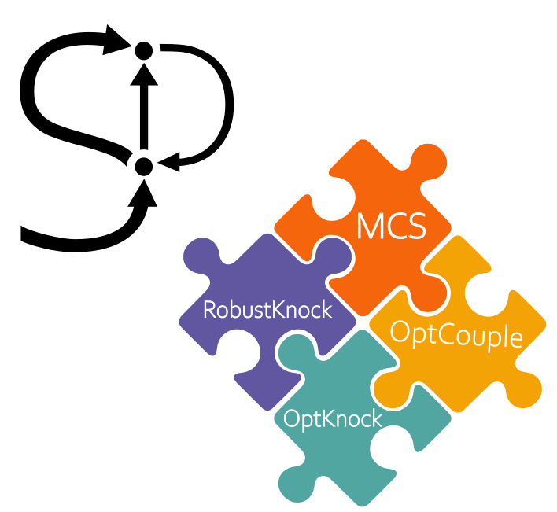
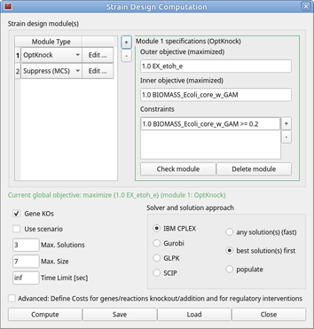

.. role:: html(raw)
   :format: html

====================================================================================
StrainDesign
====================================================================================

  
.. |logo|

.. image:: https://img.shields.io/github/v/release/klamt-lab/straindesign.svg
   :target: https://github.com/klamt-lab/straindesign/releases
   :alt: Current Release

.. image:: https://img.shields.io/pypi/v/straindesign.svg
   :target: https://pypi.org/project/straindesign/
   :alt: Current PyPI Version
   
.. image:: https://anaconda.org/cnapy/straindesign/badges/version.svg
   :target: https://anaconda.org/cnapy/straindesign/
   :alt: Current Anaconda Version
   
.. image:: https://readthedocs.org/projects/straindesign/badge/?version=latest
   :target: https://straindesign.readthedocs.io/en/latest/
   :alt: Documentation Status
   
.. image:: https://img.shields.io/pypi/pyversions/straindesign.svg
   :target: https://pypi.org/project/straindesign/
   :alt: Supported Python Versions

.. image:: https://github.com/klamt-lab/straindesign/workflows/CI-test/badge.svg
    :target: https://github.com/klamt-lab/straindesign/actions/workflows/CI-test.yml
    :alt: GitHub Actions CI-test Status]
   
.. image:: https://img.shields.io/pypi/l/straindesign.svg
   :target: https://www.gnu.org/licenses/old-licenses/lgpl-2.0.html
   :alt: Apache 2.0 License

.. image:: https://img.shields.io/badge/code%20style-yapf-blue
   :target: https://github.com/google/yapf
   :alt: YAPF
   

..
  .. image:: https://zenodo.org/badge/6510063.svg
     :target: https://zenodo.org/badge/latestdoi/6510063
     :alt: Zenodo DOI
     
A COBRApy\ :html:`<a href="#ref1">[1]</a>`\ -based package for computational design of metabolic networks
======================================================================

The comprehensive StrainDesign package for MILP-based strain design computation with the COBRApy toolbox supports MCS, MCS with nested optimization, OptKnock, RobustKnock and OptCouple, GPR-rule integration, gene and reaction knockouts and additions as well as regulatory interventions. The automatic lossless network and GPR compression allows strain design computations from genome-scale metabolic networks. Supported solvers are GLPK (available from COBRApy), CPLEX, Gurobi and SCIP (manual install, see below). :html:` ` 
`Getting started ... <https://straindesign.readthedocs.io/en/latest/>`_

|pic1| |pic2| |pic3| 

   
.. |pic2| image:: https://github.com/klamt-lab/straindesign/blob/host_gifs/docs/network.svg
  :width: 30%
  :alt: Network interventions
  
.. |pic3| image:: https://github.com/klamt-lab/straindesign/blob/host_gifs/docs/plot.gif
  :width: 40%
  :alt: Plot animation

Parts of the compression routine is done by efmtool's compression function (https://csb.ethz.ch/tools/software/efmtool.html\ :html:`<a href="#ref2">[2]</a>`). Therefore some source code from the `efmtool_link <https://github.com/cnapy-org/efmtool_link>`_ package was adopted.

Installation:
=============

The straindesign package is available on pip and Anaconda. To install the latest release, run:

``pip install straindesign``

or

``conda install -c cnapy straindesign``

Developer Installation:
-----------------------

Download the repository and run

``pip install -e .``

in the main folder. Through the installation with -e, updates from a 'git pull' are at once available in your Python envrionment without the need for a reinstallation.

Install additional solvers:
===========================

The cobra package is shipped with the GLPK solver. The more powerful commercial solvers IBM CPLEX and Gurobi may be used by cobra and the straindesign package. This makes sense in particular when using strain design algorithms like MCS, OptKnock etc. As another alternative solver, SCIP may be used. In the following, you will find installation instructions for the individual solvers.

CPLEX
-----
Together with Gurobi, CPLEX is the perfect choice for computing strain designs. Its stability and support of advanced features like indicator constraints and populating solution pools make it indispensible for genome-scale computations.

You will need an academic or commercial licence for CPLEX. Download and install the CPLEX suite and make sure that your CPLEX and Python versions are compatible. This step will not yet install CPLEX in your Python environment. Once the installation is completed, you may link your installation to your Python/conda environment. This is the next step.

Using the command line, navigate to your CPLEX installation path and into the Python folder. The path should look similar to 

``C:/Program Files/CPLEX210/python``

Make sure to activate the same Python/conda environment where `cobra` and `straindesign` are installed. Then call 

``python setup.py install``. 

Now CPLEX should be available for your computations.

The official instructions can be found here: https://www.ibm.com/docs/en/icos/22.1.0?topic=cplex-setting-up-python-api

Gurobi
------
Similar to CPLEX, Gurobi offers a fast MILP solvers with the advanced features of indicator constraints and solution pooling. The installation steps are similar to the ones of CPLEX.

First, you will need an academic or commercial license and install the Gurobi solver software. Ensure that the versions of gurobi and Python versions are compatible, install Gurobi to your system and activate your license following the steps from the Gurobi manual. In the next step you will link your Gurobi installation to your Python/conda environment.

Using the command line, navigate to your CPLEX installation path and into the Python folder. The path should look similar to 

``C:/gurobi950/windows64``

Make sure to activate the same Python/conda environment where `cobra` and `straindesign` are installed. Then call 

``python setup.py install``.

If your `gurobipy` package does not work right away, additionally install the gurobi package from conda or PyPi via

``conda install -c gurobi gurobi``

or

``python -m pip install gurobipy``

Now Gurobi should be available for your computations.

The official instructions can be found here: https://support.gurobi.com/hc/en-us/articles/360044290292-How-do-I-install-Gurobi-for-Python-

SCIP
----

Less powerfull than CPLEX and Gurobi, the open source solver SCIP still offers the solution of MILPs with indicator constraints, which gives it an edge above GLPK in terms of stability. If you want to use SCIP, you may install it via conda or pip:

``conda install -c conda-forge pyscipopt``

or

``python -m pip install pyscipopt``

Official website: https://github.com/scipopt/PySCIPOpt

CNApy integration:
=========

.. image:: https://img.shields.io/github/v/release/cnapy-org/cnapy.svg
   :target: https://github.com/cnapy-org/cnapy
   :alt: CNApy repository

CNApy, a GUI-featured toolbox for metabolic modeling offers a graphical user interface for the modeling and design of metabolic networks. The software provides a dialog box for specifying strain design problems.

|pic4|
 

  

Examples:
=========

Will be added soon...

References:
===========
:html:`<a id="ref1">[1]</a>` `Ebrahim, A., Lerman, J.A., Palsson, B.O. et al. COBRApy: COnstraints-Based Reconstruction and Analysis for Python. BMC Syst Biol 7, 74 (2013) <http://dx.doi.org/doi:10.1186/1752-0509-7-74>`_

:html:`<a id="ref2">[2]</a>` `Marco Terzer, Jörg Stelling, Large-scale computation of elementary flux modes with bit pattern trees, Bioinformatics, Volume 24, Issue 19, (2008), Pages 2229–2235, <https://doi.org/10.1093/bioinformatics/btn401>`_
